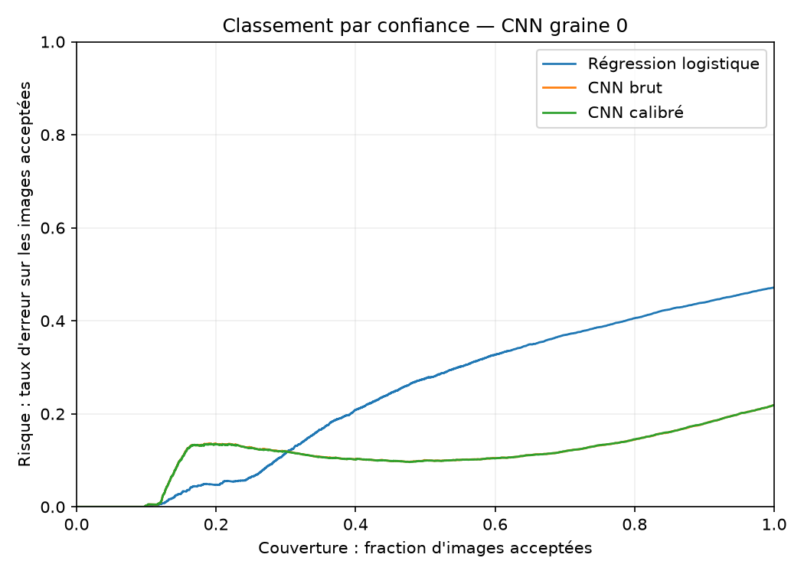
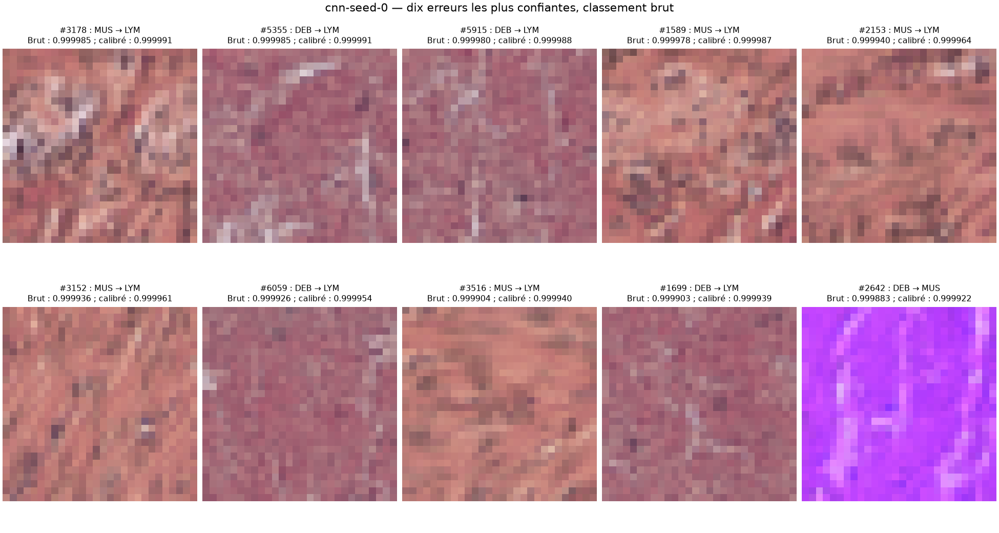

# PathMNIST Confidence

**Un modèle plus performant produit-il aussi des probabilités plus fiables ?**
Cette étude compare une régression logistique et un petit CNN sur les images
histologiques de PathMNIST. Elle examine ensuite l'effet de la calibration des
probabilités du CNN et de l'abstention : écarter les prédictions les moins
confiantes pour mesurer les erreurs parmi celles qui restent acceptées.

**Projet académique personnel**, réalisé avec scikit-learn, PyTorch et Streamlit.
**Aucun usage diagnostique ou clinique.**

[Protocole expérimental](docs/PROTOCOL.md) · [Rapport complet](results/study/report/README.md)

| L'expérience | Choix retenu |
|---|---|
| Données | PathMNIST, images couleur 28 × 28, neuf types de tissus et de contenu |
| Apprentissage | 89 996 images, partition officielle |
| Sélection / calibration | Deux moitiés stratifiées distinctes de 5 002 images |
| Test final | 7 180 images, partition officielle CRC-VAL-HE-7K |
| États comparés | Régression logistique, CNN brut, même CNN calibré |
| Répétitions | Une baseline linéaire ; trois graines CNN, quinze époques chacune |
| Évaluation | Exactitude, macro-F1, NLL, Brier, ECE et risque-couverture |
| Exploration | Streamlit à partir des prédictions enregistrées |

## Résultats observés

Trois observations ressortent de cette expérience :

- **Classification :** le CNN obtient une meilleure exactitude et un meilleur
  macro-F1 que la régression logistique dans les configurations étudiées.
- **Calibration :** l'ajustement de la température améliore légèrement la NLL
  de calibration, mais dégrade celle du test pour chacune des trois graines.
- **Abstention :** l'exactitude augmente aux couvertures rapportées ci-dessous,
  mais des erreurs très confiantes persistent parmi les images acceptées.

Évaluation sur les **7 180 images du test officiel**, après tous les entraînements
et ajustements de température. Le CNN est résumé par sa moyenne ± écart-type
d'échantillon sur trois graines ; la régression logistique n'a qu'une exécution.

| État | Exactitude (%) | Macro-F1 | NLL ↓ | Brier ↓ | ECE ↓ |
|---|---:|---:|---:|---:|---:|
| Régression logistique | 52,84 | 0,4353 | 1,2444 | 0,5770 | 0,0346 |
| CNN brut | 77,47 ± 2,12 | 0,7077 ± 0,0191 | 0,8002 ± 0,0946 | 0,3342 ± 0,0297 | 0,0362 ± 0,0119 |
| Même CNN calibré | 77,47 ± 2,12 | 0,7077 ± 0,0191 | 0,8164 ± 0,1037 | 0,3346 ± 0,0310 | 0,0378 ± 0,0192 |

Les températures apprises pour les graines 0, 1 et 2 valent respectivement
0,9578, 0,9339 et 0,9278. Sur le test, l'ECE diminue pour les graines 0 et 1,
et augmente pour la graine 2. Le Brier diminue uniquement pour la graine 1.

**La régression logistique atteint sa limite de 300 itérations sans convergence** :
son résultat ne représente donc pas une baseline linéaire pleinement optimisée.
Son ECE relativement faible, malgré une exactitude modeste, illustre aussi pourquoi
ce score seul ne suffit pas à comparer les modèles.

### Abstention : un gain conditionnel, des erreurs persistantes

La couverture est la fraction d'images acceptées. Pour la **graine 0**, choisie
à l'avance pour les illustrations :

| Couverture | Exactitude CNN brut (%) | Exactitude CNN calibré (%) |
|---|---:|---:|
| 100 % | 78,12 | 78,12 |
| 90 % | 82,08 | 82,06 |
| 75 % | 86,78 | 86,72 |
| 50 % | 89,97 | 90,06 |



Écarter la moitié des images augmente l'exactitude sur les images restantes,
mais laisse environ 10 % d'erreurs. La courbe n'est pas monotone : certains
exemples erronés se classent parmi les plus confiants. La calibration modifie
peu ce classement. L'AURC moyenne passe de **0,09918 ± 0,02034** à
**0,09876 ± 0,02036** ; cette petite baisse ne signifie pas une amélioration à
chaque couverture.

### Erreurs à haute confiance



Pour les graines 0, 1 et 2, le nombre d'erreurs de confiance ≥ 0,9 passe
respectivement de **334 à 355**, **120 à 145** et **250 à 308** après calibration.
Les températures inférieures à 1 rendent ici les distributions plus concentrées,
y compris sur des prédictions incorrectes.

Pour la graine 0, la paire débris → muscle lisse représente 128 de ces erreurs
avant calibration, puis 129 après ; mucus → fond apparaît aussi parmi les paires
fréquentes des trois graines.

### Coût et traçabilité

Le CNN compte **106 089 paramètres**, contre **21 177** pour la baseline.
L'entraînement CNN prend **713,1 ± 8,8 s** par graine, sélection et sauvegardes
comprises ; la régression logistique prend **241,2 s**, conversion des pixels
comprise. Ces périmètres diffèrent et le CPU est partagé : ces durées ne sont
pas un benchmark matériel contrôlé. Le téléchargement, la calibration et
l'évaluation finale en sont exclus.

Les [mesures non arrondies](results/study/report/runs.csv) et
[écarts calibré − brut](results/study/report/paired-differences.csv) permettent
de vérifier la synthèse. Le rapport complet présente chaque graine, ses diagrammes
de fiabilité, courbes, matrices de confusion et erreurs.

Une [première tentative interrompue](results/README.md) est conservée ; elle
n'avait pas atteint l'évaluation du test. Aucun entraînement n'a été relancé
en fonction de sa performance de test.

## Méthode

### Sélectionner, calibrer, puis évaluer

```text
Entraînement officiel ────────── apprentissage des poids

Validation officielle ┬──────── sélection du checkpoint : 5 002 images
                      └──────── ajustement de T uniquement : 5 002 images

Test officiel ───────────────── évaluation finale après sélection et calibration
```

La séparation de la validation est stratifiée et déterministe ; ses indices
sont enregistrés avant les expériences. La sélection du checkpoint et l'ajustement
de la température utilisent des images distinctes. Les hyperparamètres sont fixés,
sans recherche sur le test. Les règles numériques et les paramètres figurent dans
le [protocole](docs/PROTOCOL.md) et sa [configuration](protocol.json).

**La régression logistique** reçoit les 2 352 pixels aplatis, divisés par 255.
Elle fournit une baseline linéaire scikit-learn, avec régularisation L2, `C=1`,
solveur L-BFGS et au plus 300 itérations.

**Le CNN**, entraîné depuis une initialisation aléatoire avec PyTorch, reçoit les
images dans leur structure spatiale. Il comporte deux blocs
convolution–ReLU–max-pooling, avec 16 puis 32 canaux, suivis d'une couche dense
de 64 neurones et de neuf logits. Chaque graine utilise Adam pendant quinze
époques ; le checkpoint de NLL minimale sur la sélection est retenu.
Ni augmentation, ni poids préentraînés, ni dropout.

**Le CNN calibré partage exactement les mêmes poids.** Seule une température
positive est apprise sur la partition de calibration : `softmax(logits / T)`.
L'ordre des logits d'une image ne change pas. Les classes prédites, l'exactitude
et le macro-F1 restent donc identiques ; les probabilités peuvent changer.
Le classement des images par confiance peut toutefois changer en multiclasse.

### Ce que mesurent les scores

| Mesure | Interprétation |
|---|---|
| Exactitude, macro-F1 | Qualité des classes prédites ; plus haut est préférable |
| NLL | Pénalisation logarithmique de la probabilité attribuée à la vraie classe |
| Brier | Écart quadratique entre distribution prédite et étiquette ; somme sur les neuf classes, plage [0, 2] |
| ECE | Écart confiance–exactitude de la classe prédite, sur quinze intervalles de largeur égale |
| Risque-couverture | Taux d'erreur parmi les images conservées, selon la fraction acceptée |
| AURC | Moyenne des risques cumulés du classement ; plus bas est préférable |

La NLL et le Brier évaluent les distributions prédictives, pas uniquement la
calibration. L'ECE dépend du découpage en intervalles : les diagrammes montrent
aussi leurs effectifs.

### Erreurs et abstention

Les dix erreurs les plus confiantes sont sélectionnées automatiquement, sans
filtrage visuel, par confiance brute décroissante puis indice croissant en cas
d'égalité. Les mêmes images sont affichées avec leur confiance avant et après
calibration. Les résultats des trois graines sont conservés dans le rapport.

Pour l'abstention, le modèle accepte une image si sa confiance maximale atteint
le seuil. Le rapport distingue les seuils fixés avant les expériences et les
couvertures obtenues en classant le test. Le réglage du seuil dans la démo reste
une exploration de résultats déjà observés. Si aucune image n'est acceptée,
l'exactitude sur les images acceptées est indéfinie.

## Données, limites et portée

PathMNIST utilise des patchs histologiques issus de **NCT-CRC-HE-100K** pour le
développement et de **CRC-VAL-HE-7K** pour le test. Les
[métadonnées de MedMNIST](https://github.com/MedMNIST/MedMNIST/blob/main/medmnist/info.py)
décrivent le test comme provenant d'un autre centre clinique. Toutefois,
l'[archive originale](https://zenodo.org/records/1214456) mentionne le NCT et
l'UMM pour le développement, puis le NCT pour le test, en précisant que les
patients du test sont distincts de ceux du développement.

**L'indépendance stricte des centres n'est donc pas établie ici.** L'expérience
porte sur la partition de test officielle ; elle ne permet ni d'attribuer les
écarts observés à un effet de centre, ni de démontrer une robustesse générale
aux changements de distribution.

Les neuf codes utilisés dans les figures sont : ADI (tissu adipeux), BACK (fond),
DEB (débris), LYM (lymphocytes), MUC (mucus), MUS (muscle lisse), NORM (muqueuse
colique normale), STR (stroma associé au cancer), TUM (épithélium d'adénocarcinome
colorectal).

- Les observations sont des patchs, pas des patients indépendants. La division
  sélection/calibration ne garantit pas une séparation par patient, faute
  d'identifiants utilisés à cette fin.
- La résolution de 28 × 28 limite les informations disponibles. Aucun avis
  histopathologique indépendant n'interprète les erreurs.
- Trois graines décrivent la variabilité du CNN sur une partition fixe. Les
  écarts-types rapportés ne sont pas des intervalles de confiance ; les répétitions
  sur les mêmes images ne constituent pas de nouveaux patients.
- La baseline linéaire et le CNN n'ont ni capacité ni budget de calcul identiques.
  La comparaison porte sur ces configurations ; aucun réglage optimal n'est revendiqué.
- La température est optimisée pour la NLL de calibration, pas pour l'ECE, le
  Brier ou le risque du test. Leur amélioration n'est pas garantie.
- Une bonne calibration globale ne garantit pas la fiabilité d'une prédiction
  individuelle ni une calibration correcte pour chaque classe.
- Les seuils de confiance ne constituent pas une garantie de risque pour de
  nouvelles données. Aucune validation clinique n'est réalisée.

Les images distribuées dans les résultats proviennent de PathMNIST sous CC BY 4.0.
Les sources, attributions et transformations figurent dans la
[notice](THIRD_PARTY_NOTICES.md).

Le projet [Fashion-MNIST Study](https://github.com/KenziBoughadou/fashion-mnist-study)
reste une étude distincte de comparaison MLP/CNN. Il ne contient pas les expériences
de calibration présentées ici.
