# Résultats PathMNIST

Statut de l'étude : **complete**.

| Exécution | Statut |
|---|---|
| logistic | complete |
| cnn-seed-0 | complete |
| cnn-seed-1 | complete |
| cnn-seed-2 | complete |

## Tous les résultats

| Modèle | T | Exactitude | Macro-F1 | NLL | Brier | ECE | AURC |
|---|---:|---:|---:|---:|---:|---:|---:|
| logistic | 1.0000 | 0.5284 | 0.4353 | 1.2444 | 0.5770 | 0.0346 | 0.2423 |
| cnn-seed-0 | 1.0000 | 0.7812 | 0.7049 | 0.7620 | 0.3318 | 0.0440 | 0.1124 |
| cnn-seed-0-calibrated | 0.9578 | 0.7812 | 0.7049 | 0.7732 | 0.3320 | 0.0424 | 0.1123 |
| cnn-seed-1 | 1.0000 | 0.7918 | 0.7280 | 0.7307 | 0.3057 | 0.0225 | 0.0758 |
| cnn-seed-1-calibrated | 0.9339 | 0.7918 | 0.7280 | 0.7413 | 0.3049 | 0.0166 | 0.0753 |
| cnn-seed-2 | 1.0000 | 0.7510 | 0.6902 | 0.9078 | 0.3649 | 0.0420 | 0.1094 |
| cnn-seed-2-calibrated | 0.9278 | 0.7510 | 0.6902 | 0.9347 | 0.3668 | 0.0542 | 0.1087 |

Les exactitudes et ECE sont exprimées en fractions, pas en pourcentages. Le Brier somme les neuf classes (plage [0, 2]). Une NLL, un Brier, une ECE ou une AURC plus faibles sont préférables.

## Synthèse des trois états

| État | Répétitions | Exactitude | Macro-F1 | NLL | Brier | ECE | AURC |
|---|---:|---:|---:|---:|---:|---:|---:|
| Régression logistique | 1 | 0.5284 | 0.4353 | 1.2444 | 0.5770 | 0.0346 | 0.2423 |
| CNN brut | 3 | 0.7747 ± 0.0212 | 0.7077 ± 0.0191 | 0.8002 ± 0.0946 | 0.3342 ± 0.0297 | 0.0362 ± 0.0119 | 0.0992 ± 0.0203 |
| CNN calibré | 3 | 0.7747 ± 0.0212 | 0.7077 ± 0.0191 | 0.8164 ± 0.1037 | 0.3346 ± 0.0310 | 0.0378 ± 0.0192 | 0.0988 ± 0.0204 |

Écarts-types d'échantillon sur les graines CNN, pas des intervalles de confiance. La baseline linéaire a une seule exécution. Le CNN calibré partage les poids du CNN brut ; ses lignes ne sont pas des modèles entraînés indépendamment.

Régression logistique : convergence signalée **False**, itérations [300], durée 241.20 s.

- ConvergenceWarning : lbfgs failed to converge after 300 iteration(s) (status=1):
STOP: TOTAL NO. OF ITERATIONS REACHED LIMIT

Increase the number of iterations to improve the convergence (max_iter=300).
You might also want to scale the data as shown in:
    https://scikit-learn.org/stable/modules/preprocessing.html
Please also refer to the documentation for alternative solver options:
    https://scikit-learn.org/stable/modules/linear_model.html#logistic-regression

[Écarts calibré − brut par graine](paired-differences.csv) · [Mesures non arrondies et durées](runs.csv)

## Calibration

La température est ajustée uniquement sur la calibration ; ces diagrammes portent sur le test officiel, ou sur la sélection dans un essai court. Les intervalles vides restent sans mesure. Les effectifs sont affichés.

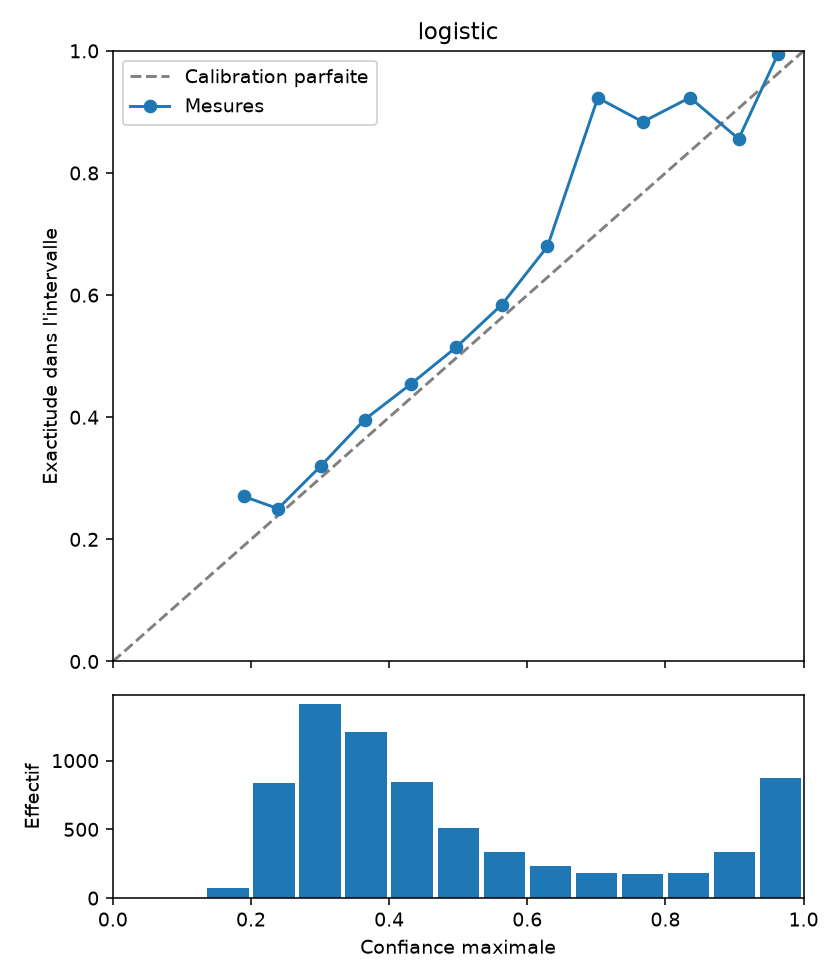

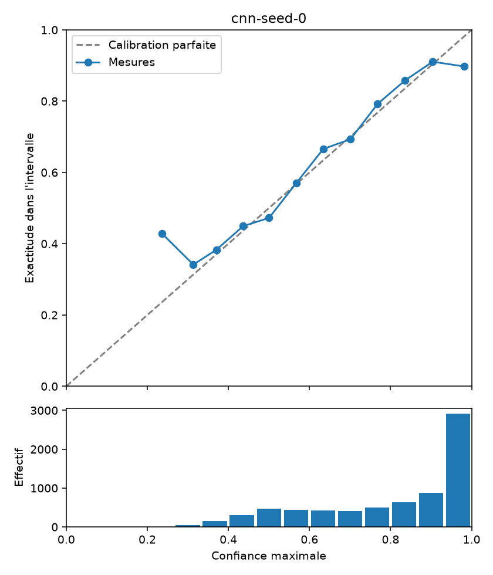

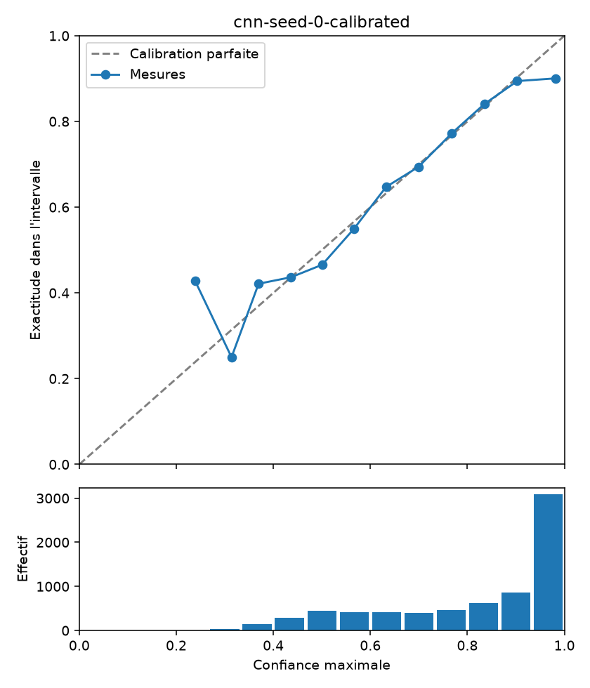

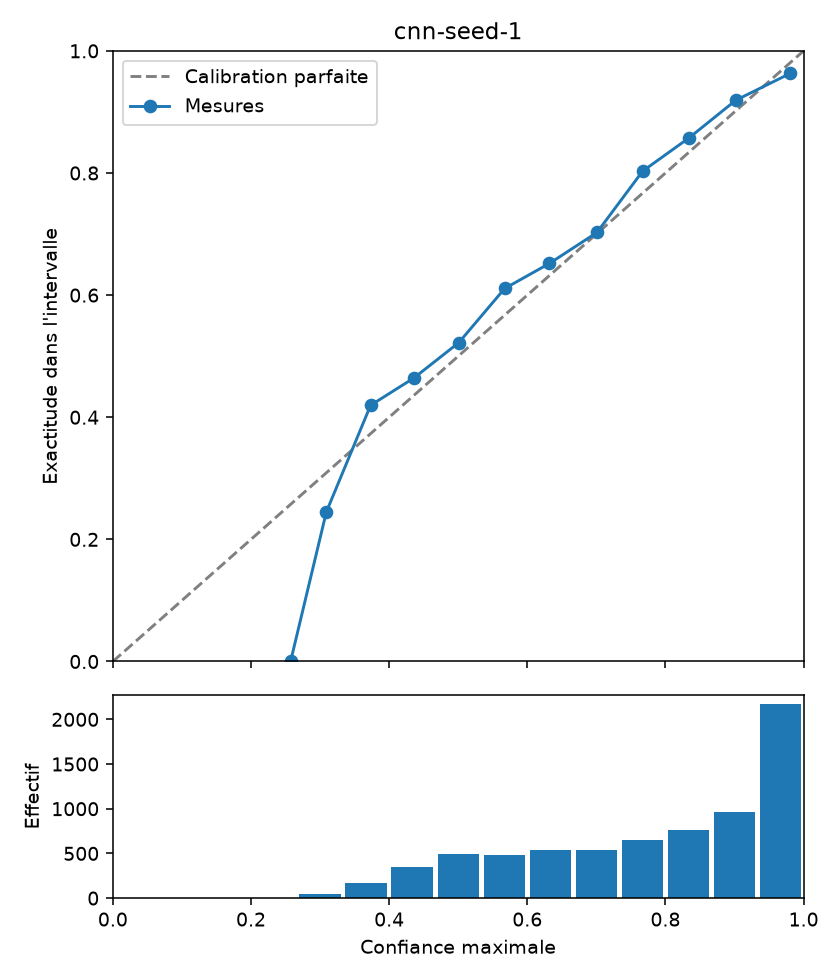

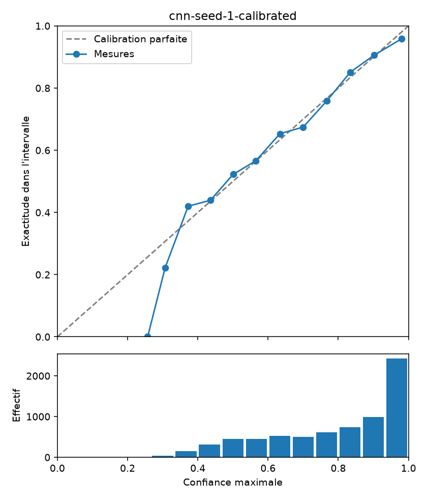

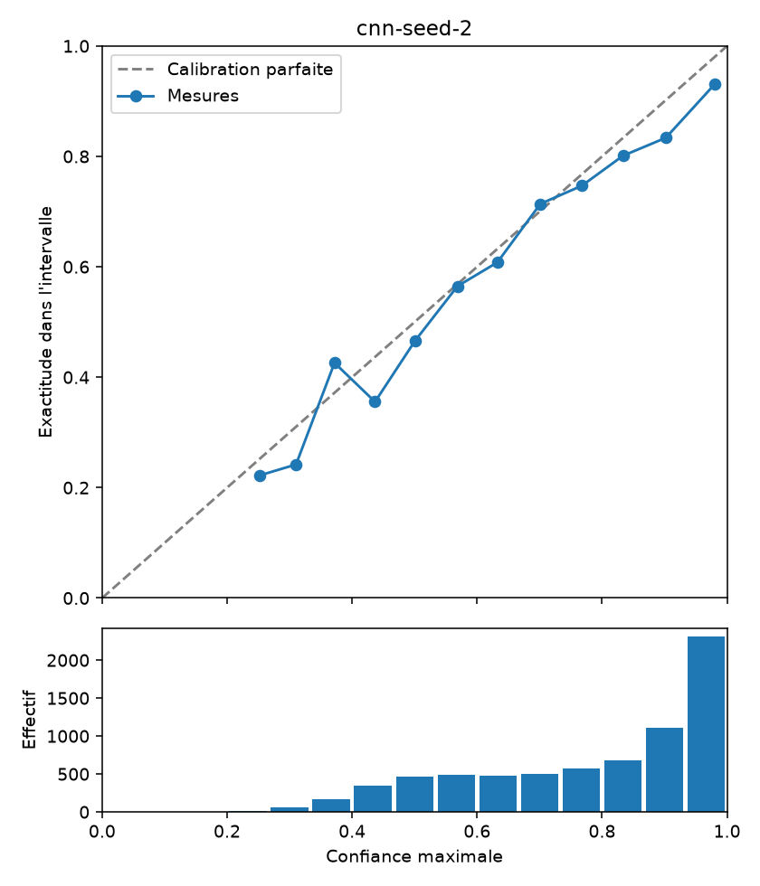

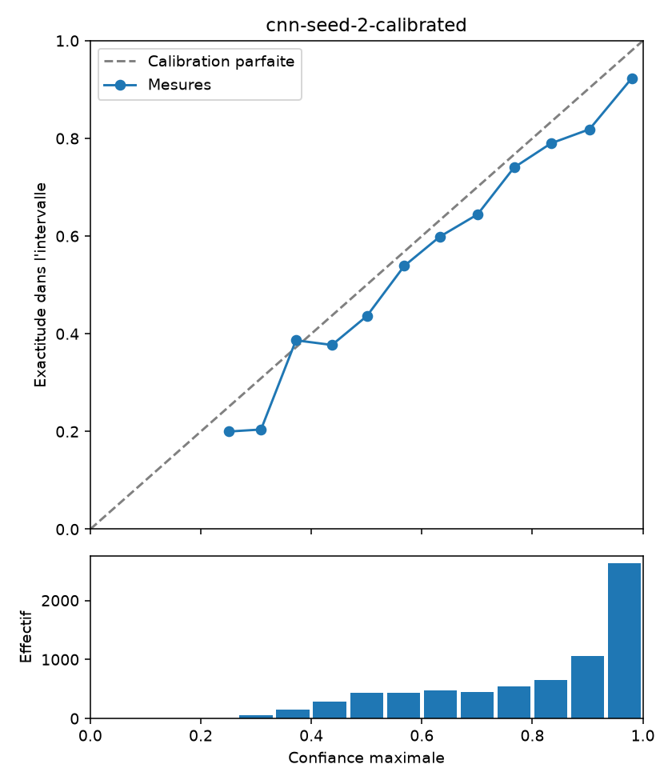

## Abstention

Risque = taux d'erreur parmi les images acceptées. Le classement par confiance départage les ex aequo par indice croissant. L'AURC est la moyenne des risques pour k = 1 à N exemples acceptés.

[Couvertures fixées](coverage.csv) · [Seuils fixés](thresholds.csv)

Les couvertures fixées décrivent un classement du test ; elles ne choisissent pas un seuil déployable avec risque garanti. Un seuil choisi dans la démo reste une exploration du test déjà observé.

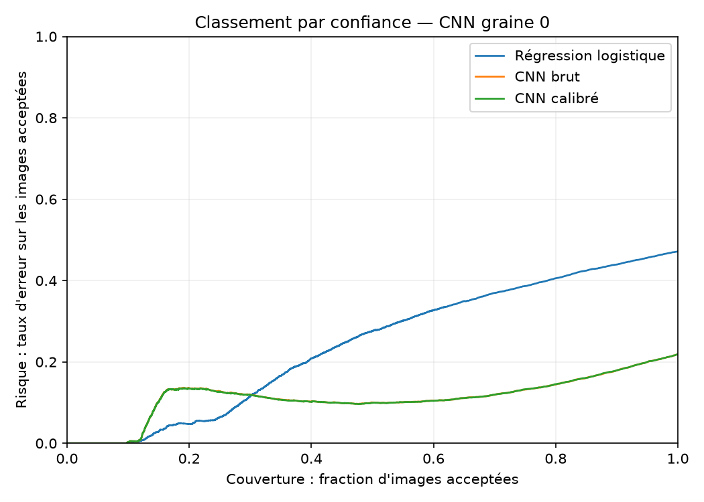

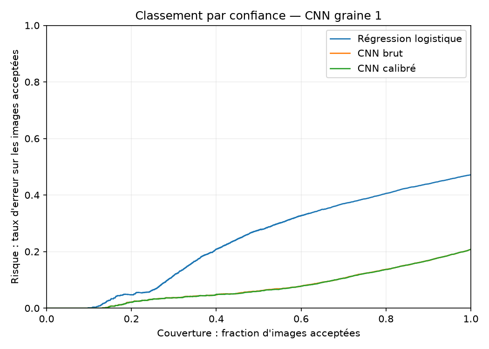

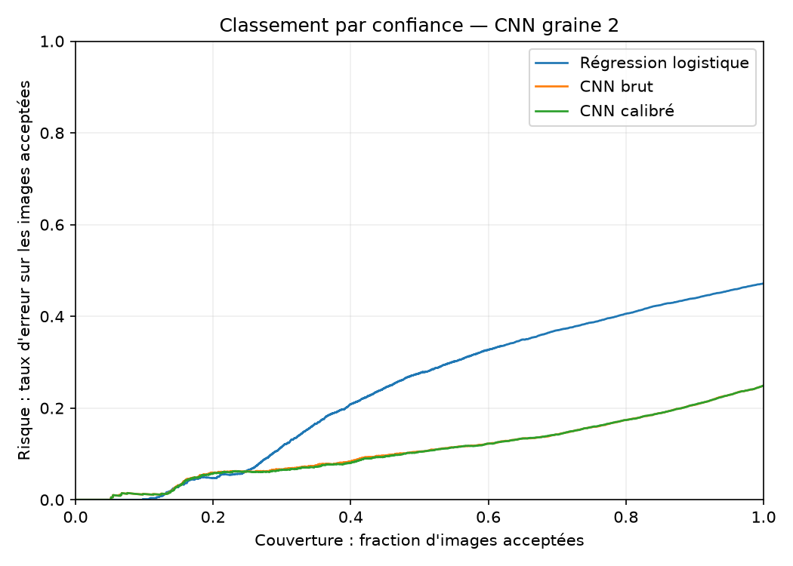

## Erreurs à haute confiance

Les dix erreurs sont classées automatiquement par confiance brute décroissante. Leur confiance calibrée est affichée sur les mêmes images. Les tableaux séparés du CNN calibré utilisent son propre classement. Les codes des classes figurent dans le README principal.

[Toutes les paires de confusion à confiance ≥ 0,9](high-confidence-error-pairs.csv)

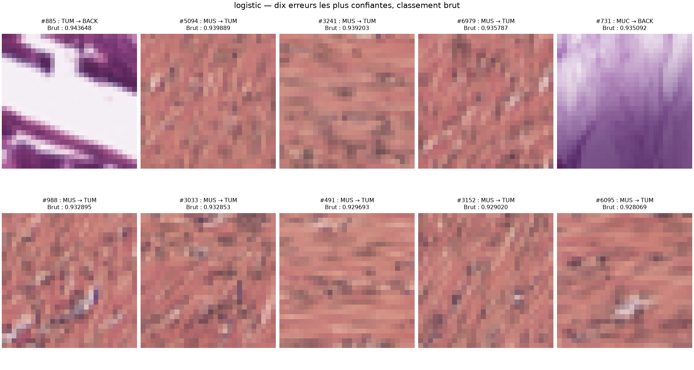

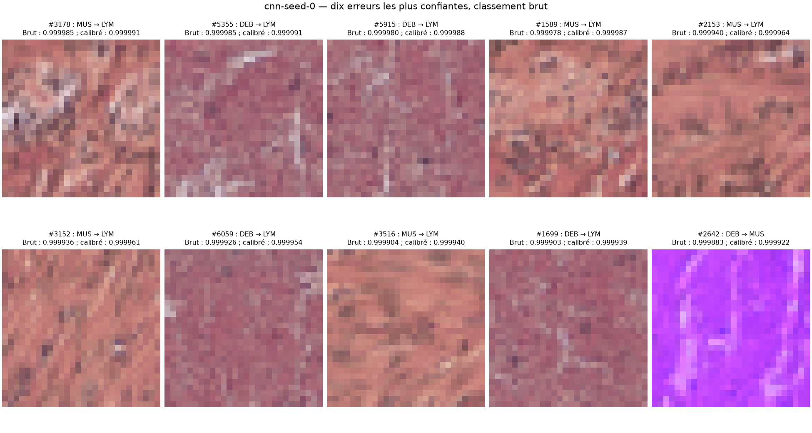

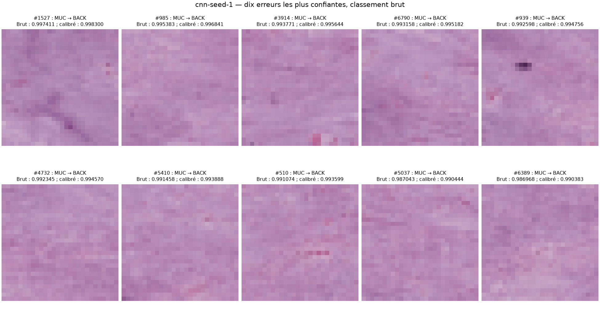

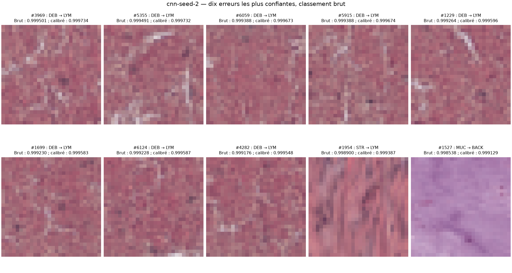

## Apprentissage

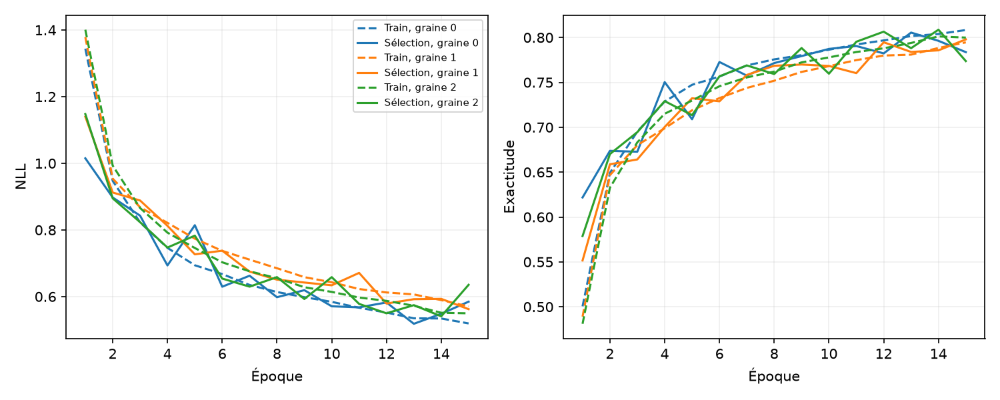

Les mesures train sont prises pendant les mises à jour ; celles de sélection en fin d'époque, avec des poids fixes.

Images PathMNIST / MedMNIST, CC BY 4.0. Attribution et transformations dans la notice à la racine du dépôt.
